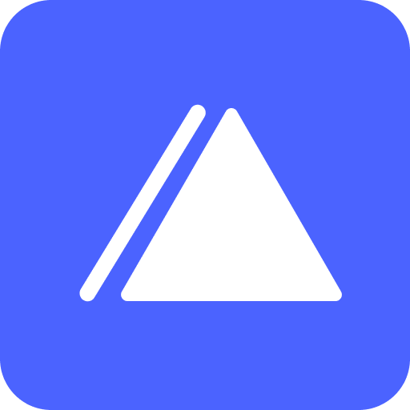
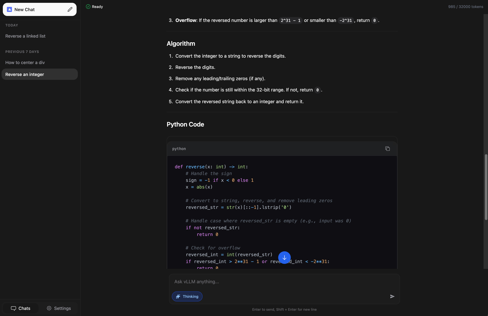

<h1 align="center">

<br />
vLLM Web Interface
</h1>

<p align="center">
<a href="https://nextjs.org/"></a>
<a href="https://tailwindcss.com/"></a>
<a href="https://github.com/your-username/your-repo-name/actions"></a>
</p>

<p align="center">
A modern, friendly, and responsive web interface for interacting with <a href="https://docs.vllm.ai/en/latest/">vLLM</a> language models. Built with Next.js and Shadcn UI.
</p>

<div align="center">


</div>

<br />

## ✨ Features

- **🚀 Fast & Reactive:** Built on Next.js for optimal performance.
- **💬 Streaming Support:** Real-time token streaming from vLLM.
- **🎨 Modern UI:** Clean interface using TailwindCSS and Shadcn UI.
- **📝 Markdown Support:** Renders code blocks and standard markdown syntax.
- **⚙️ Configurable:** Easy setup for different model endpoints and system prompts.

## ⚙️ Prerequisites

Before running the web interface, ensure you have the following:

- **vLLM Instance:** You must have vLLM running separately (locally or via Docker).
   > **Note:** Ensure your vLLM API is accessible (default port is usually 8000).
- **Node.js:** Version 18+ ([Download](https://nodejs.org/)).
- **Package Manager:** `npm` or `yarn`.

## 🚀 Getting Started

Follow these instructions to set up the project locally.

### 1. Clone the repository

```bash
git clone https://github.com/CoderUni/CodingLLM.git
cd CodingLLM/web
```

### 2. Install Dependencies

```bash
yarn install
# or
npm install
```

### 3. Configure Environment

Rename the example environment file to `.env`:

```bash
mv .example.env .env
```

Open `.env` and configure it to match your vLLM setup:

```env
# The API endpoint for your vLLM instance
VLLM_URL="http://localhost:8000/v1"

# The specific model name you are serving (Must match vLLM config)
VLLM_MODEL="BigJuicyData/Anni"

# Context window limit
VLLM_TOKEN_LIMIT="32000"

# Default system prompt for the chat
NEXT_PUBLIC_SYSTEM_PROMPT="You are a helpful assistant."
```

### 4. Run Development Server

```bash
yarn dev
```

Open [http://localhost:3000](http://localhost:3000) in your browser to start chatting!

## 🛠️ Tech Stack

- **Framework:** [Next.js](https://nextjs.org/)
- **Styling:** [TailwindCSS](https://tailwindcss.com/)
- **Components:** [shadcn/ui](https://ui.shadcn.com/) (Radix UI + Tailwind)
- **Chat Logic:** shadcn-chat

## 🤝 Acknowledgments

Forked from [yoziru/nextjs-vllm-ui](https://github.com/yoziru/nextjs-vllm-ui).

This version includes bug fixes, UI improvements, and enhanced stability.
